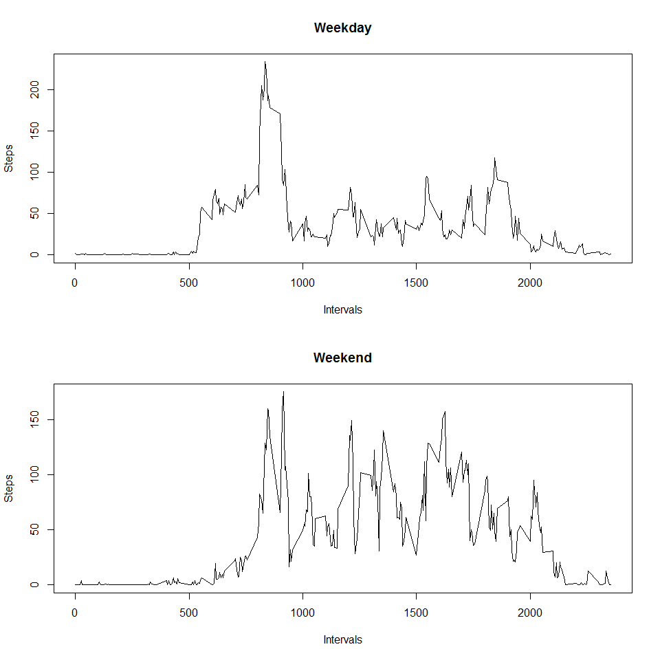

## Loading and preprocessing the data

```r
suppressMessages(library(dplyr))
suppressMessages(library(lubridate))
unzip("activity.zip")
activity <- read.csv("activity.csv")
```
## What is mean total number of steps taken per day?

### Making a histogram of the total number of steps taken each day


```r
stepsPerDay <- activity %>% group_by(date) %>% summarise(steps = sum(steps, na.rm = TRUE))
barplot(stepsPerDay$steps, names.arg = stepsPerDay$date, cex.names = 0.7, las = 2)
```

<!-- -->

### Calculating and reporting the mean and median of the total number of steps taken per day


```r
meanSteps <- round(mean(stepsPerDay$steps, na.rm = TRUE), 2)
medianSteps <- median(stepsPerDay$steps, na.rm = TRUE)
```

The mean of the total number of steps taken per day is 9354.23  
The median of the total number of steps taken per day is 10395

## What is the average daily activity pattern?

### Making a time series plot of the 5-minute interval (x-axis) and the average number of steps taken, averaged across all days (y-axis)


```r
avgStepsPerInterval <- activity %>% group_by(interval) %>% summarise(average = mean(steps, na.rm = TRUE))
plot(x = avgStepsPerInterval$interval, y = avgStepsPerInterval$average, type = "l", 
     xlab="Intervals", ylab = "Average number of steps taken averaged across all days")
```

<!-- -->

### Which 5-minute interval, on average across all the days in the dataset, contains the maximum number of steps?


```r
maximumStepsInInterval <- max(avgStepsPerInterval$average, na.rm = TRUE)
intervalWithMaxSteps <- avgStepsPerInterval$interval[avgStepsPerInterval$average == maximumStepsInInterval]
```

The 5-minute interval, on average across all the days in the dataset,
that contains the maximum number of steps is 835
which on average has 206.17 steps

## Imputing missing values

### Calculating and reporting the total number of missing values in the dataset


```r
missingValues <- sum(is.na(activity$steps))
```

Total number of missing values in the dataset is 2304

### Creating a new dataset that is equal to the original dataset but with the missing data filled in


```r
filledActivity <- activity

fillMissing <- function(x, y){
  if(is.na(x)){
    return(avgStepsPerInterval[avgStepsPerInterval[,"interval"] == y, "average"])
  } else {
    return(x)
  }
}

filledActivity$steps <- as.numeric(mapply(fillMissing, filledActivity$steps, filledActivity$interval))
```

### Making a histogram of the total number of steps taken each day


```r
filledStepsPerDay <- filledActivity %>% group_by(date) %>% summarise(steps = sum(steps))
barplot(filledStepsPerDay$steps, names.arg = filledStepsPerDay$date, cex.names = 0.7, las = 2)
```

<!-- -->

### Calculating and reporting the mean and median total number of steps taken per day


```r
filledMeanSteps <- as.integer(mean(filledStepsPerDay$steps))
filledMedianSteps <- as.integer(median(filledStepsPerDay$steps))
```

After including data from the average steps per interval into missing steps info:  
The mean of the total number of steps taken per day is 10766  
The median of the total number of steps taken per day is 10766

### What is the impact of imputing missing data on the estimates of the total daily number of steps?

We can conclude from this, is that filling the dataset with the the mean steps
for that 5-minute interval didn't only significially rise the mean and slightly
rise the median numbers, they also turned out to be equal due to the dataset
having a large number of missing values, which caused both the median and the mean
to skew towards the same number!

## Are there differences in activity patterns between weekdays and weekends?

### Creating a new factor variable in the dataset with two levels – “weekday” and “weekend” indicating whether a given date is a weekday or weekend day


```r
weekFactor <- function(x){
  if(weekdays(as.Date(x)) %in% c("Saturday", "Sunday")){
    return("Weekend")
  } else {
    return("Weekday")
  }
}

activity$week <- as.factor(mapply(weekFactor, activity$date))
```

### Making a time series plot of the 5-minute interval (x-axis) and the average number of steps taken, averaged across all weekday days or weekend days (y-axis)


```r
weekdayActivity <- filter(activity, week == "Weekday")
avgStepsWeekday <- weekdayActivity %>% group_by(interval) %>% summarise(average = mean(steps, na.rm = TRUE))
weekendActivity <- filter(activity, week == "Weekend")
avgStepsWeekend <- weekendActivity %>% group_by(interval) %>% summarise(average = mean(steps, na.rm = TRUE))
plot(x = avgStepsWeekday$interval, y = avgStepsWeekday$average, type = "l", col = "blue",
     xlab="Intervals", ylab = "Average number of steps taken")
lines(x = avgStepsWeekend$interval, y = avgStepsWeekend$average, type = "l", col = "red")
legend("topleft", legend = c("Weekday", "Weekend"), col=c("blue", "red"), lty=1, cex=1)
```

<!-- -->
